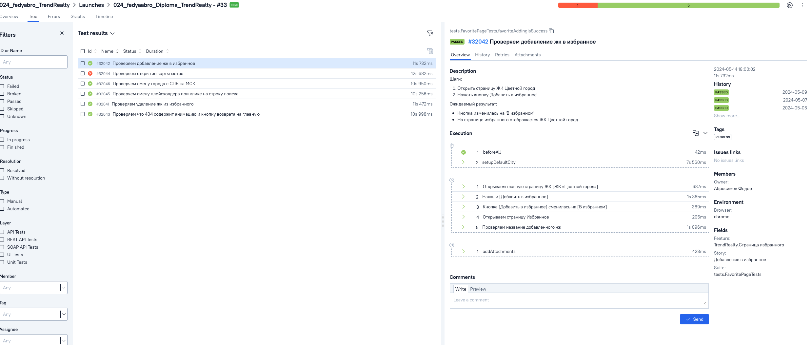

# Дипломный проект. UI тесты для платформы [TrendRealty](https://msk.trendrealty.ru/)


##  О платформе
TrendRealty B2C платформа для подбора недвижимости

## Содержание
- <a href="#stack">Стек</a>
- <a href="#testcases">Тест-кейсы</a>
- <a href="#running">Запуск автотестов</a>
- <a href="#report">Отчет Allure</a>
- <a href="#testops">Интеграция с Allure TestOps</a>
- <a href="#jira">Интеграция с Jira</a>
- <a href="#telegram">Нотификация в бот</a>
- <a href="#Selenoid">Пример запуска тестов</a>

<a id="stack"></a>
## Стек
<p  align="center">

<code></code>
<code></code>
<code></code>
<code></code>
<code></code>
<code></code>
<code></code>
<code></code>
<code></code>
<code></code>
<code></code>
<code></code>
</p>

Тесты в данном проекте написаны на языке ```Java``` с использованием фреймворка для тестирования ```Selenide```, сборщик - ```Gradle```. ```JUnit 5``` задействован в качестве фреймворка модульного тестирования.
При прогоне тестов для запуска браузеров используется ```Selenoid```.
Для удаленного запуска реализована джоба в <code>Jenkins</code> с формированием Allure-отчета и отправкой результатов в <code>Telegram</code> при помощи бота. Так же реализована интеграция с <code>Allure TestOps</code> и <code>Jira</code>.

<a id="testcases"></a>
## Тест-кейсы
- Добавление в избранное
- Удаление из избранного
- Смена города
- Проверка изменения плейсхолдера при клике
- Проверка открытия карты метро
- Проверка отображения 404 страницы


<a id="running"></a>
## Запуск автотестов из консоли
```
gradle clean owner_tests
```
## [ Запуск автотестов из Jenkins](https://jenkins.autotests.cloud/job/024_fedyaabro_Diploma_TrendRealty/)
Build with Parameters --> Build, при необходимости можно добавить комментарий или сменить(По умолчанию установлены дефолтные значения):

- Окружение
- Браузер
- Версию браузера
- Размер окна браузера
- Url удаленного запуска


## Параметры сборки Jenkins
```
clean owner_tests
-Denvironment=${environment}
-Dbrowser=${browser}
-DbrowserVersion=${browserVersion}
-DbrowserSize=${browserSize}
-DbrowserRemoteUrl=${browserRemoteUrl}
```


<a id="report"></a>
##  [Отчеты Allure](https://jenkins.autotests.cloud/job/024_fedyaabro_Diploma_TrendRealty/allure/#)
 
 
 

<a id="testops"></a>
##  [Интеграция с Allure TestOps](https://allure.autotests.cloud/project/4216/dashboards)
 
 

<a id="jira"></a>
##  [Интеграция с Jira](https://jira.autotests.cloud/browse/HOMEWORK-1213)
 

<a id="telegram"></a>
## Нотификация в бот 


## Пример запуска теста
<a id="Selenoid"></a>
 

